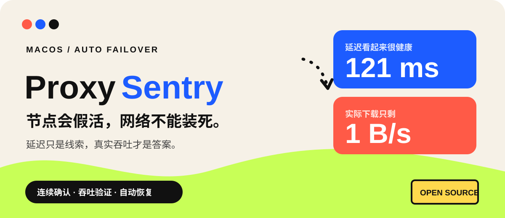
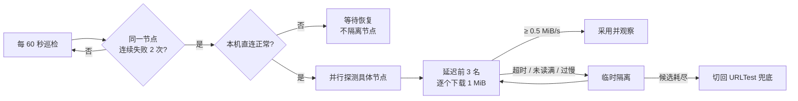

<p align="center">
  
</p>

<p align="center">
  <a href="LICENSE"></a>
  
  
  
</p>

<p align="center">
  一个不把「延迟低」误当成「网络能用」的 macOS 节点故障切换脚本。<br>
  为 Clash Verge Rev / mihomo 而写，平时安静巡检，故障时才接管。
</p>

---

## 为什么会有它？

真实故障很离谱：节点延迟 **121 ms**，看起来一切正常，实际下载速度却只有 **1 B/s**。

纯延迟探活看不见这种“半残节点”。ProxySentry 会在确认故障后，从低延迟候选里逐个做一次小流量真实下载；读不满、超时或吞吐不达标，都不会把你切过去。

> **它不是测速排名工具。** 目标是在网络坏掉时，尽快找到第一个真正能用的节点，然后停手。

## 30 秒看懂



| 你在意的事 | ProxySentry 怎么做 |
| --- | --- |
| 会不会网络一抖就乱切？ | 同一节点连续失败 2 次，切换前再复检一次 |
| 本机断网会不会误伤全部节点？ | 先做直连检查；离线期间绝不新增隔离 |
| 延迟正常但线路半死怎么办？ | 前 3 名逐个下载 1 MiB，读满且 ≥ 0.5 MiB/s 才采用 |
| 坏节点会不会永远拉黑？ | 10 分钟起步的 TTL，重复失败指数退避，最长 4 小时 |
| 我手动选节点，它会抢吗？ | 识别手动选择；具体节点重新观察，策略组完全尊重 |
| 全部节点都不行呢？ | 切回 `自动选择` 止血，并继续退避扫描恢复节点 |

完整状态机、恢复边和结果分类见 [`docs/DESIGN.md`](docs/DESIGN.md)。

## 快速开始

### 运行要求

- macOS
- Clash Verge Rev / mihomo Unix 控制接口
- 系统自带 `/usr/bin/python3` 与 `/usr/bin/curl`
- 默认 Selector：`主代理`
- 默认 URLTest 兜底组：`自动选择`

### 安装

```sh
mkdir -p ~/.workbuddy/bin ~/.workbuddy/logs
chmod 700 ~/.workbuddy ~/.workbuddy/bin ~/.workbuddy/logs
install -m 600 clash-guard.py ~/.workbuddy/bin/clash-guard.py
sed "s|__HOME__|$HOME|g; s|com.example.clash-guard|com.$USER.clash-guard|g" \
  com.example.clash-guard.plist > ~/Library/LaunchAgents/com.$USER.clash-guard.plist
chmod 600 ~/Library/LaunchAgents/com.$USER.clash-guard.plist
launchctl bootstrap gui/$(id -u) ~/Library/LaunchAgents/com.$USER.clash-guard.plist
```

LaunchAgent 已负责每分钟调度。正常安装不需要 `clash-guard-loop.sh`；循环壳只用于不使用 launchd 的兼容场景。

卸载：

```sh
launchctl bootout gui/$(id -u)/com.$USER.clash-guard
```

## 配置

| 变量 | 默认值 | 用途 |
| --- | --- | --- |
| `CLASH_GUARD_SOCKET` | `/tmp/verge/verge-mihomo.sock` | Unix socket 路径 |
| `CLASH_GUARD_SELECTOR` | `主代理` | 被守护的 Selector |
| `CLASH_GUARD_FALLBACK` | `自动选择` | URLTest 兜底组 |
| `CLASH_GUARD_PROXY` | `http://127.0.0.1:7897` | 吞吐测试使用的本地 HTTP 代理入口 |

LaunchAgent 中可通过 `EnvironmentVariables` 字典配置这些值。

### 吞吐验证前提

`CLASH_GUARD_PROXY` 对应的本地 HTTP 代理入口必须经过被守护的 Selector，否则测速结果不能代表刚切换的候选节点。

候选验证会短暂依次选中节点，现有连接可能瞬断。这是因为 mihomo API 无法在不切换 Selector 的情况下，让测试流量指定经过某个候选节点。

## 安全边界

- 非阻塞进程锁阻止 LaunchAgent、循环壳和手动运行互相重叠。
- 每次切换前后都检查当前选择；发现用户改选，立即停止自动操作。
- 状态以原子方式写入，日志和状态权限固定为 `0600`。
- API 响应限制为 4 MiB；节点名严格 URL 编码；日志清洗控制字符。
- 脚本不上传配置、节点名或日志。探活与吞吐测试只访问文档列出的固定测试地址。

> [!IMPORTANT]
> mihomo 的 Unix socket 控制接口没有 `secret` 鉴权。它的安全边界是 socket 和父目录的本机文件权限。多人共用的 Mac 应特别检查其他用户是否可以访问该 socket。详情见 [`SECURITY.md`](SECURITY.md)。

## 测试

```sh
PYTHONPYCACHEPREFIX="$PWD/.pycache" /usr/bin/python3 -m unittest discover -s tests -v
/bin/bash -n clash-guard-loop.sh
plutil -lint com.example.clash-guard.plist
```

预期结果：15 个单元测试全部通过，shell 与 plist 语法检查通过。

## 项目结构

```text
clash-guard.py                  主程序
com.example.clash-guard.plist   LaunchAgent 模板
clash-guard-loop.sh             不使用 launchd 时的兼容循环壳
docs/DESIGN.md                  状态机与故障策略
SECURITY.md                     威胁模型与安全边界
tests/                          回归测试
```

## 设计参考

本项目吸收了 [mihomo-smart-controller](https://github.com/AlexWhite1111/mihomo-smart-controller) 的稳定优先和故障分类思路，以及 [clash-switch](https://github.com/1deaaa/clash-switch) 的小型本地控制器经验；本实现针对 macOS LaunchAgent、Unix socket、手动选择保护和低流量吞吐验证重新设计。

## License

MIT
